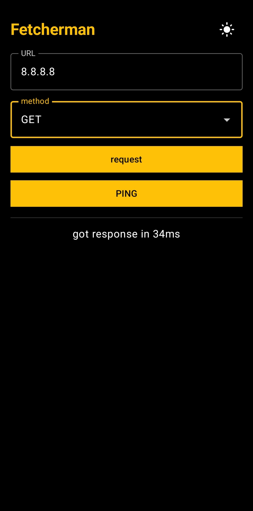
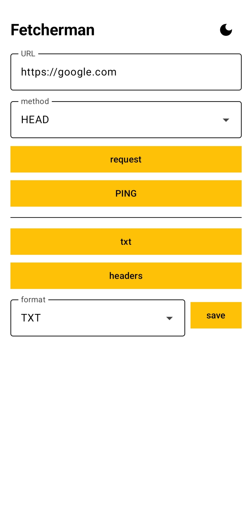

# 🧑‍🔧 Fetcherman

A cURL-like HTTP utility for Android. Enter a URL, pick a method, make the request, inspect
the raw response (body, headers, content type) and save it to a file — or ping a host with a
real ICMP echo and see the round-trip time.

## 🖼️ Images

<div style="display: flex; flex-direction: horizontal; gap: 10px;">
  
  
</div>

## 📥 Downloading

APK files can be found on [releases page](https://github.com/PlushkaNet/fetcherman/releases)

## ✨ Features

- 🌐 HTTP requests with `GET`, `POST`, `PUT`, `OPTIONS`, `DELETE`, `PATCH`, `HEAD`, `TRACE`, `CONNECT`
  and a JSON body field (for methods that support one)
- 🔍 Response inspection: decoded body text, raw headers, `Content-Type`, raw bytes
- 💾 Saving responses as RAW, TXT, or pretty-printed JSON via the system file picker
- 📡 Ping with a real ICMP echo request (native unprivileged ping socket), with a
  `InetAddress.isReachable()` fallback
- 🌗 Light/dark theme toggle

Ping details worth knowing up front:

- **Ping is ICMP, not HTTP, and the URL port is ignored:** `ping` extracts the hostname
  from the URL (scheme, path, query, userinfo and port are stripped; bracketed IPv6 like
  `http://[::1]:8080/` is handled). It then sends an ICMP echo to that host — a web
  server on port 8080 does not matter to it.
- **Cleartext HTTP is allowed:** The app can talk to plain `http://` URLs (useful for a
  debugging tool), which means HTTP traffic can be intercepted on the network — do not
  send secrets over non-HTTPS URLs.
- **Save format nuance:** `RAW` writes the exact received bytes and its file extension is
  guessed from the response `Content-Type`; `TXT` writes the decoded text; `JSON` writes
  the pretty-printed JSON only if the body actually parses as JSON, otherwise the raw text.

## 🛠️ Building

Requirements:

- ☕ JDK 17 (`java -version`) — the project sets a Java 17 toolchain
- 🤖 Android SDK with platform 37 and build tools 37.0.0 (set `sdk.dir` in `local.properties`
  or the `ANDROID_HOME` env var)
- 🧩 NDK + CMake (pulled automatically by AGP 9.x for the native ping library)

Build, test and install:

```sh
./gradlew :app:testDebugUnitTest   # 🧪 unit tests (HTTP client + ping fallback)
./gradlew :app:assembleDebug       # 📦 debug APK
./gradlew :app:installDebug        # 📲 install on a connected device
just tests                         # 🔁 same as testDebugUnitTest (if you use just)
```

The app targets 📱 minSdk 26 (Android 8.0) and ships `arm64-v8a`, `armeabi-v7a` native libs.

## ⚠️ Non-obvious behavior

- **Redirects are not followed now:** A 301/302 is returned as-is with its headers, including
  the `Location` header.

- **Responses are held entirely in memory with no size limit:** A huge response may
  consume a lot of RAM or crash the app. The text/header dialogs additionally truncate
  display at 50 000 characters (saving to a file is never truncated).

- **Ping has two modes:** On most devices a real ICMP echo is sent via an unprivileged
  ping socket. Where SELinux or the vendor blocks that, it falls back to
  `InetAddress.isReachable()` (a TCP connect to the echo port, port 7). In fallback mode
  the reported RTT is the TCP connect time, and "timeout" vs "unreachable" is decided by
  a heuristic: if the whole timeout budget was burned, it is reported as a timeout,
  otherwise as unreachable.

- **Charset handling:** The body is decoded using the `charset` from `Content-Type`;
  if the charset is unknown or missing, UTF-8 is used. Saving as TXT always writes UTF-8.

- **The request body must be valid JSON:** it is parsed before sending; an unparseable
  body (plain text, malformed JSON) fails the request with an error instead of being
  sent as-is.

- **Requests are cancelled when a new one starts:** or the activity is destroyed (the
  response state survives screen rotation, but not process death).

- **`CONNECT` is implemented over a raw socket:** `HttpURLConnection` does not support it, so
  the client opens a plain TCP connection to the URL host:port and sends a bare
  `CONNECT host:port HTTP/1.1` request. The response is the status line plus response
  headers; no tunnel body is read afterwards.

## ✏️ Contributing

Bug reports, feature requests and pull requests are welcome — feel free to open issues and PRs.

## 📄 License

[ISC](./LICENSE)